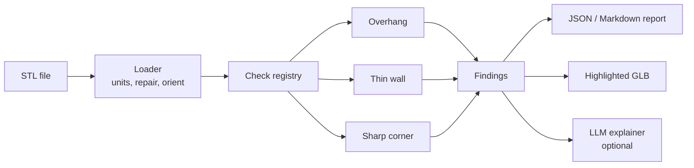
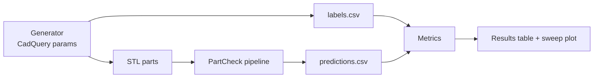

# PartCheck: Automated Manufacturability Review for 3D Parts

2026-09-16 · @u_VWu_3IJPqsi_WYmPnhxWdw

## Overview

PartCheck is a Python command-line tool that reads a 3D part (STL), detects three common manufacturability issues, and produces a report with the problem faces highlighted. It was built in 5 days and evaluated on an auto-labeled synthetic dataset.

**Why it fits the CoLab co-op:** it is a small-scale version of automated design review (AutoReview) and it includes measured precision and recall (Applied ML). It touches every must-have (Python, software projects, Git) and most bonus points (geo

metry, linear algebra, CAD exposure, evaluation, optional LLM layer).

**Success criteria**

| Criterion | Target |
| --- | --- |
| Checks implemented | 3 (overhang, thin wall, sharp internal corner) |
| Evaluation dataset | 40–60 generated parts with ground-truth labels |
| Metrics reported | Precision, recall, F1 per check, plus a threshold sweep for thin walls |
| Tests | At least 8 pytest unit tests, run in GitHub Actions |
| Usability | `partcheck part.stl` prints a report and exports a highlighted GLB |
| Documentation | README with demo image, results table, design decisions, limitations |

## Scope and key decisions

The project works on triangle meshes only, which keeps setup under an hour and leaves time for evaluation.

**In scope**

- Loading STL files and normalizing units to millimetres
- Three geometric checks with configurable thresholds
- A synthetic part generator that writes ground-truth labels
- An evaluation script with per-check metrics
- JSON and Markdown reports, plus a GLB file with flagged faces coloured red
- Optional: an LLM step that explains each issue and suggests a fix

**Out of scope**

- Native STEP/B-rep parsing (pythonOCC), which is slow to install and learn
- 2D drawing review
- A web app or cloud deployment
- Training ML models

**Key technical decisions**

| Decision | Choice | Reason |
| --- | --- | --- |
| Geometry library | trimesh | pip install, has normals, adjacency and ray casting built in |
| Ray acceleration | embreex (optional) | Much faster ray casts; trimesh falls back to pure Python without it |
| Part generation | CadQuery, exported to STL | Parametric, so labels come free; fallback is trimesh + manifold3d booleans |
| Config | YAML file with thresholds | Different processes (molding, printing, milling) need different limits |
| Reports | Pydantic models to JSON, then Markdown | Typed and easy to test |
| CLI | Typer | Clean interface in a few lines |
| Tests and CI | pytest + GitHub Actions | Covers the Git workflow must-have |
| Python version | 3.11 | Good support across all libraries above |

## Architecture

PartCheck is a linear pipeline: load, run each check independently, collect findings, then write outputs. Checks share one interface, so adding a fourth check means adding one file.



The evaluation path reuses the same pipeline on generated parts and compares findings with the labels.



**Components**

| Component | Responsibility | Key interface |
| --- | --- | --- |
| `loader.py` | Load STL, check watertightness, scale to mm, rest part on z = 0 | `load_part(path, units) -> trimesh.Trimesh` |
| `checks/base.py` | Shared contract for all checks | `Check.run(mesh, config) -> list[Finding]` |
| `checks/*.py` | One detection algorithm each | Registered by name in `CHECKS` |
| `models.py` | Data types | `Finding(check, severity, face_ids, value, threshold, message)` |
| `report.py` | Build JSON and Markdown reports | `build_report(part, findings) -> Report` |
| `visualize.py` | Colour flagged faces, export GLB and PNG | `export_highlighted(mesh, findings, path)` |
| `explain.py` | Optional LLM explanation of findings | `explain(report) -> str` |
| `cli.py` | Typer entry point | `partcheck check PART [--config] [--out]` |
| `generator/` | Parametric part families with labels | `generate(n, seed) -> labels.csv` |
| `evaluation/` | Metrics and threshold sweeps | `evaluate(labels, predictions)` |

**Repository structure**

```
partcheck/
├── src/partcheck/
│   ├── __init__.py
│   ├── cli.py
│   ├── loader.py
│   ├── models.py
│   ├── report.py
│   ├── visualize.py
│   ├── explain.py
│   └── checks/
│       ├── base.py
│       ├── overhang.py
│       ├── thin_wall.py
│       └── sharp_corner.py
├── generator/
│   ├── families.py      # bracket, shelled box, plate with pocket
│   └── generate.py
├── evaluation/
│   ├── evaluate.py
│   └── sweep.py
├── configs/default.yaml
├── tests/
├── docs/images/
├── .github/workflows/ci.yml
├── pyproject.toml
└── README.md
```

**Default config (`configs/default.yaml`)**

```yaml
units: mm
checks:
  overhang:
    max_angle_deg: 45
    min_area_mm2: 1.0
  thin_wall:
    min_thickness_mm: 1.0
    ray_offset_mm: 0.01
  sharp_corner:
    max_concave_angle_deg: 60
    min_edge_length_mm: 2.0
```

## Detection checks

Each check returns a list of `Finding` objects; a part counts as flagged for a check when that list is not empty. All three rely on face normals, so the loader must run `mesh.merge_vertices()` and `mesh.fix_normals()` first.

### 1. Overhang (3D printing)

A surface tilted more than 45° from vertical needs support material. For a face with unit normal **n**, its tilt from vertical equals the normal's angle below horizontal, so the face is an overhang when `n_z < -sin(45°)`.

1. Compute `n_z = mesh.face_normals[:, 2]` and flag faces below `-sin(max_angle)`.
2. Drop faces lying on the build plate (centroid z within 0.01 mm of the minimum z).
3. Group flagged faces into connected regions with `trimesh.graph.connected_components` on `mesh.face_adjacency`.
4. Keep regions whose total area (`mesh.area_faces`) exceeds `min_area_mm2`; report area and worst angle.

```python
nz = mesh.face_normals[:, 2]
on_plate = mesh.triangles_center[:, 2] < mesh.bounds[0, 2] + 0.01
flagged = np.where((nz < -np.sin(np.radians(max_angle))) & ~on_plate)[0]
```

**Unit tests:** a plain cube has no overhangs; a T-shape standing upright flags the underside of the T's arms.

### 2. Thin wall (injection moulding, printing)

Local thickness is the distance from a surface point, travelling inward, to the opposite surface. Flag points thinner than `min_thickness_mm`.

1. Subdivide large triangles (`mesh.subdivide_to_size(max_edge=2.0)`) so each face is a fair sample point.
2. Set ray origins at `centroid - normal * offset` and directions at `-normal`; the small offset stops the ray hitting its own face.
3. Cast with `mesh.ray.intersects_location(origins, directions, multiple_hits=False)` and compute hit distances.
4. Reject hits on faces whose normal is not roughly opposite (`dot(n_origin, n_hit) > -0.5`). This removes the main false positive: rays grazing an adjacent wall near a corner.
5. Skip rays with no hit (a sign of a non-watertight mesh) and count them in the report.
6. Group thin faces into regions and report minimum thickness per region.

```python
origins = mesh.triangles_center - mesh.face_normals * offset
locs, ray_idx, tri_idx = mesh.ray.intersects_location(
    origins, -mesh.face_normals, multiple_hits=False)
dist = np.linalg.norm(locs - origins[ray_idx], axis=1)
opposite = np.einsum('ij,ij->i', mesh.face_normals[ray_idx], mesh.face_normals[tri_idx]) < -0.5
thin = ray_idx[opposite & (dist < min_thickness)]
```

**Unit tests:** a 10 mm cube is not thin; a hollow box with 0.5 mm walls is flagged with thickness close to 0.5 mm.

### 3. Sharp internal corner (CNC milling)

A round cutter cannot produce a sharp concave corner, so internal corners need a fillet. On a mesh, an unfilleted corner is a single concave edge with a large angle between the two face normals; a fillet becomes many edges with small angles.

1. Read `mesh.face_adjacency_angles` (angle between normals, 0 means coplanar) and `mesh.face_adjacency_convex`.
2. Keep edges that are concave and whose angle exceeds `max_concave_angle_deg` (60° catches 90° corners but ignores fillet facets).
3. Get edge geometry from `mesh.face_adjacency_edges`, merge collinear connected edges, and drop chains shorter than `min_edge_length_mm`.
4. Report each corner's length and angle, and flag both adjacent faces.

**Important:** export generated STLs with a fine angular tolerance (for example 0.1 rad in CadQuery). A coarse export can turn a fillet into one or two large facets and trigger false positives.

**Unit tests:** a block with a sharp rectangular pocket is flagged; the same pocket with 3 mm corner fillets is not; a plain cube (only convex edges) is not.

### Optional check ideas for later

- Deep narrow holes: fit cylinders to face clusters and compare depth with diameter.
- Draft angle: side faces of a moulded part should tilt at least 1° from the pull direction.
- Non-watertight or self-intersecting meshes, reported as a data-quality check.

## Dataset and evaluation

The generator knows every part's parameters, so each part gets ground-truth labels at no labelling cost. Target 50 parts with a fixed random seed so results are reproducible.

**Part families**

| Family | Parameters randomized | Defects it can contain |
| --- | --- | --- |
| L-bracket | Leg lengths, thickness 0.4–4 mm, hole count, inner fillet 0 or 1–5 mm | Thin wall, sharp internal corner |
| Shelled box | Size, wall thickness 0.4–3 mm, open or closed top, orientation | Thin wall, overhang (closed top printed upright) |
| Plate with pocket | Plate size, pocket depth, corner radius 0 or 1–4 mm | Sharp internal corner |
| T-bar / bridge | Arm length, arm angle 20–90° from vertical | Overhang |

Aim for roughly half the parts to be positive for each check so the metrics are meaningful. Include some borderline cases, such as walls at 0.9–1.1 mm and arms at 40–50°.

**Label derivation (written by the generator)**

- `thin_wall = thickness < 1.0`
- `sharp_corner = has_pocket_or_inner_corner and fillet_radius == 0`
- `overhang = unsupported_arm_angle > 45` or a closed ceiling above the plate

`labels.csv` columns: `part_id, family, seed, params_json, thin_wall, sharp_corner, overhang`.

**Metrics**

- Part-level precision, recall and F1 for each check, plus a confusion matrix
- Threshold sweep for thin walls (0.5–2.0 mm in 0.1 mm steps) plotted as precision and recall against threshold
- Runtime per part and mesh face count, to show performance awareness
- An error analysis table listing every false positive and false negative with a one-line cause

**Honesty rules**

- Fix thresholds before the final run; do not tune on the same parts you report on. Use a 30-part dev set and a separate 20-part test set with a different seed.
- Report the numbers you get, even if they are not perfect.
- State the main limitation clearly: synthetic parts are cleaner than real CAD, so real-world performance will be lower.

**Stretch: real-part sanity check.** Run PartCheck on 5–10 real models from the ABC Dataset or Thingiverse, and show qualitative results (screenshots) without claiming metrics.

## Phases

The build runs in five one-day phases, with evaluation on Day 3 so it is never squeezed out. Each phase ends with a pushed, working commit.

| Phase | Day | Goal | Deliverable |
| --- | --- | --- | --- |
| 1. Foundation | 1 | Repo, loader, first check | `partcheck check cube.stl` runs the overhang check |
| 2. Core checks | 2 | Thin wall and sharp corner, with tests | 3 checks passing 8+ unit tests |
| 3. Data and evaluation | 3 | Generator and metrics | `results.md` with precision, recall, sweep plot |
| 4. Outputs and polish | 4 | Reports, 3D highlight, optional LLM | JSON/Markdown report and GLB with red faces |
| 5. Presentation | 5 | README, CI, application | Public repo, updated resume, submitted application |

### Phase 1: Foundation (Day 1)

- [ ] Create the GitHub repo with `pyproject.toml`, `.gitignore`, MIT licence, and the folder structure above
- [ ] Set up a virtual environment; install `trimesh numpy scipy networkx pyyaml pydantic typer pytest` and try `embreex`
- [ ] Install CadQuery in a separate step and confirm it can export an STL (switch to the manifold3d fallback if this takes over an hour)
- [ ] Write `models.py` (`Finding`, `Report`) and `checks/base.py`
- [ ] Write `loader.py`: load, merge vertices, fix normals, check watertightness, move the part onto z = 0
- [ ] Implement the overhang check and a minimal Typer CLI
- [ ] Test by hand on a cube and a T-shape; commit with clear messages

### Phase 2: Core checks (Day 2)

- [ ] Implement the thin-wall check with subdivision, ray offset and the opposite-normal filter
- [ ] Implement the sharp-corner check with concave-edge filtering and edge-length grouping
- [ ] Write `tests/conftest.py` fixtures that build test shapes with trimesh primitives
- [ ] Write at least 8 unit tests (positive and negative case per check, plus loader tests)
- [ ] Load thresholds from `configs/default.yaml`
- [ ] Work on a feature branch and merge through a pull request, to show a collaborative workflow

### Phase 3: Data and evaluation (Day 3)

- [ ] Write the four part families in `generator/families.py`
- [ ] Write `generator/generate.py` to create dev (seed 1, 30 parts) and test (seed 2, 20 parts) sets with `labels.csv`
- [ ] Open a few generated parts in a viewer to confirm they look right
- [ ] Write `evaluation/evaluate.py` to run the pipeline and compute per-check metrics
- [ ] Tune thresholds on the dev set only, then run once on the test set
- [ ] Write `evaluation/sweep.py` and save the thin-wall threshold plot to `docs/images/`
- [ ] Write the error analysis table in `results.md`

### Phase 4: Outputs and polish (Day 4)

- [ ] Write `report.py` to produce JSON and a readable Markdown summary
- [ ] Write `visualize.py` to colour flagged faces (red for errors, orange for warnings) and export GLB
- [ ] Render 2–3 PNG screenshots for the README (PyVista off-screen or a GLB viewer)
- [ ] Add CLI options: `--config`, `--out`, `--format json|md`
- [ ] Optional: write `explain.py`, which sends the report JSON to an LLM and returns a plain-language explanation with fixes; keep it behind an `--explain` flag and read the API key from an environment variable
- [ ] Clean up code: type hints, docstrings, run `ruff`

### Phase 5: Presentation and applying (Day 5)

- [ ] Add `.github/workflows/ci.yml` to run ruff and pytest on every push; add the badge to the README
- [ ] Write the README (outline in the Presentation section)
- [ ] Record a short demo GIF of the CLI and the highlighted model
- [ ] Read through your own code so you can explain every design choice
- [ ] Update your resume and cover letter, then submit the application

## Risks and fallbacks

If you fall behind, cut the LLM layer first, then the 3D export (keep screenshots), then the third check. Never cut the evaluation.

| Risk | Sign | Fallback |
| --- | --- | --- |
| CadQuery will not install | Still failing after 1 hour | Build parts with trimesh primitives and `manifold3d` booleans |
| Ray casting is slow | Over 30 s per part | Install `embreex`, or cap subdivision at a larger edge size |
| Thin-wall false positives near corners | Flags at every edge | Tighten the opposite-normal filter; ignore hits within one offset of an edge |
| Fillets flagged as sharp corners | Filleted pockets flagged | Export with a finer angular tolerance; raise the angle threshold |
| Non-watertight meshes | Many rays with no hit | Run `trimesh.repair` steps; report the part as unreliable instead of guessing |
| Metrics look perfect | 100% on every check | Add borderline and noisy parts; perfect scores on easy data are not convincing |
| Running out of time | Behind at end of Day 3 | Ship two checks with full evaluation instead of three without it |

## Presentation

The README and a two-sentence mention in your cover letter are what reviewers will actually see, so write them carefully.

**README outline**

1. One-line description, CI badge, and a demo GIF
2. What it checks and why each issue matters in manufacturing
3. Quick start: install, then `partcheck check examples/bracket.stl`
4. How it works: the pipeline diagram and a short note on each algorithm
5. Results: the metrics table, the threshold sweep plot, and the error analysis
6. Design decisions: why meshes over STEP, why synthetic labels, why these thresholds
7. Limitations and next steps: synthetic data, no B-rep, ideas such as draft angles and learned detectors

**Resume line** (fill in your real numbers)

> **PartCheck** — Python tool that detects manufacturability issues (thin walls, overhangs, unfilleted internal corners) in 3D parts using ray casting and mesh geometry; evaluated on an auto-labelled synthetic test set, reaching X% precision and Y% recall. Python, trimesh, CadQuery, pytest, GitHub Actions.

**Cover letter sentences**

> After reading about AutoReview, I wanted to understand the problem better, so I built PartCheck, a small tool that flags manufacturability issues in 3D parts. The most useful part was the evaluation: generating labelled parts showed me where geometric rules break down, especially near corners and curved surfaces.

**Interview preparation**

- Explain why ray casting estimates thickness and where it fails
- Explain how you avoided tuning on your test set
- Describe one false positive in detail and how you would fix it
- Say how you would handle real STEP files (B-rep faces, exact cylinders, pythonOCC)
- Say where ML could help: learning which flags engineers actually care about from past review feedback
