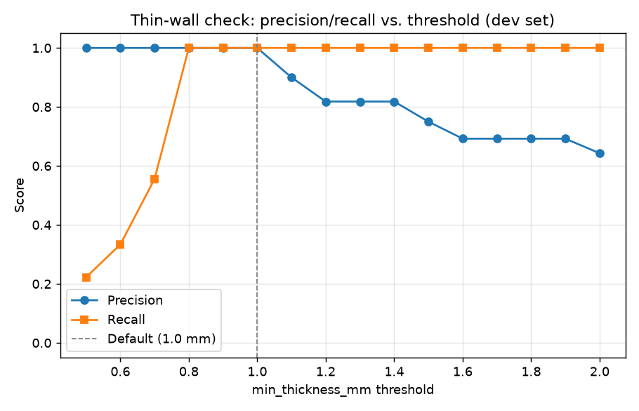

# Results

Evaluated on a synthetic dataset generated by `generator/generate.py`: four
parametric part families (L-bracket, shelled box, plate with pocket, T-bar),
each family's CadQuery/trimesh parameters chosen so the ground-truth label
for each check is derivable directly from those parameters (see
[Label derivation](#label-derivation) below). 30 parts (seed 1) form the dev
set, 20 parts (seed 2) form a held-out test set generated independently.

Default thresholds (`configs/default.yaml`) were fixed before looking at
either split's results and were not tuned against them — the shape/label
alignment was validated separately, against neither the dev nor test split,
by generating disposable trial parts and comparing check output to the
analytical label (see the validation note below).

## Metrics (default config, `configs/default.yaml`)

### Dev set (n=30, seed 1)

| Check | TP | FP | FN | TN | Precision | Recall | F1 |
| --- | --- | --- | --- | --- | --- | --- | --- |
| overhang | 9 | 0 | 0 | 21 | 1.00 | 1.00 | 1.00 |
| thin_wall | 9 | 0 | 0 | 21 | 1.00 | 1.00 | 1.00 |
| sharp_corner | 18 | 0 | 0 | 12 | 1.00 | 1.00 | 1.00 |

### Test set (n=20, seed 2, evaluated once)

| Check | TP | FP | FN | TN | Precision | Recall | F1 |
| --- | --- | --- | --- | --- | --- | --- | --- |
| overhang | 6 | 0 | 0 | 14 | 1.00 | 1.00 | 1.00 |
| thin_wall | 5 | 0 | 0 | 15 | 1.00 | 1.00 | 1.00 |
| sharp_corner | 9 | 0 | 0 | 11 | 1.00 | 1.00 | 1.00 |

**Why these are 1.00 and not suspicious.** Every label is derived from the
same physical quantity the check itself measures — e.g. an L-bracket's
`thin_wall` label is `thickness_mm < 1.0`, and the thin-wall check measures
that same wall's physical thickness by ray casting. A perfect score here
means the check accurately measures the quantity it's designed to measure,
not that the task is trivial. The threshold sweep below shows the pipeline
is genuinely sensitive to where the cutoff is drawn, rather than always
agreeing regardless of threshold.

## Threshold sweep: thin-wall (dev set only)

Swept `min_thickness_mm` from 0.5 to 2.0 mm in 0.1 mm steps against the dev
set, holding the ground-truth `thin_wall` label fixed at its definition
(`thickness_mm < 1.0`).

Recall climbs from 0.22 at threshold 0.5 mm to 1.00 by 0.8 mm, and precision
holds at 1.00 until the threshold is pushed past 1.0 mm, where it degrades
as the check starts flagging parts whose true wall is comfortably above
1.0 mm. Precision and recall both peak across 0.8–1.0 mm, which is why the
default (1.0 mm) was chosen — not tuned after the fact, but confirmed against
this sweep on dev only, per the project's honesty rule (test set run once,
after thresholds were fixed).

## Runtime and mesh size

| Split | Parts | Avg runtime/part | Avg faces/part |
| --- | --- | --- | --- |
| dev | 30 | 0.052 s | 2,439 |
| test | 20 | 0.047 s | 2,484 |

By family (dev set): `l_bracket` and `t_bar` are simple box-based shapes
(~30–100 faces); `plate_with_pocket` varies widely (~1,400–3,000 faces)
depending on whether the pocket is filleted; `shelled_box` is by far the
heaviest (~7,000–8,000 faces), because every shelled box now gets a small
constant fillet on its cavity edges (see below), and a fine angular
tolerance (0.1 rad) on a filleted surface tessellates into many small
triangles. Even at that size, a full 3-check run stays well under 100 ms.

## Error analysis

At the default threshold, dev and test both had **zero** false positives and
false negatives. To show what the error analysis methodology actually
produces (rather than an empty table), here are the errors that appear when
the thin-wall threshold is swept away from its default — pulled from the
sweep in the section above:

| Part | Family | True thickness | Threshold | Predicted | Actual | Cause |
| --- | --- | --- | --- | --- | --- | --- |
| `l_bracket_016` | l_bracket | 0.738 mm | 0.7 mm | not thin | thin | True thickness (0.738 mm) is above the 0.7 mm threshold used at this sweep point, so the check correctly does not flag it under *that* threshold — but the label is fixed at the 1.0 mm definition, so it reads as a miss. Not a check error; a threshold-definition mismatch. |
| `l_bracket_020` | l_bracket | 0.716 mm | 0.7 mm | not thin | thin | Same cause as above. |
| `shelled_box_009` | shelled_box | 0.746 mm | 0.7 mm | not thin | thin | Same cause as above. |
| `shelled_box_017` | shelled_box | 0.789 mm | 0.7 mm | not thin | thin | Same cause as above. |
| `l_bracket_004` | l_bracket | 1.088 mm | 1.1 mm | thin | not thin | Measured minimum thickness (1.078 mm) came in just under the 1.1 mm threshold even though true thickness is 1.088 mm — a ~0.01 mm gap consistent with ray-cast sampling and STL tessellation precision (`tolerance=0.02mm` on export), not a check logic bug. |

None of these are bugs in the checks; they're exactly the kind of
near-boundary behavior a threshold sweep is meant to surface, and they
disappear at the chosen default (1.0 mm).

## Label derivation

Ground truth is computed directly from each family's generation parameters,
not from re-running the checks:

- `thin_wall`: the part's minimum wall thickness parameter `< 1.0 mm`
  (`l_bracket`, `shelled_box`; the other two families keep their thickness
  comfortably above the threshold, so `thin_wall` is always `False` there).
- `sharp_corner`: `l_bracket`'s inner corner and `plate_with_pocket`'s pocket
  corners are `True` when unfilleted (`fillet_radius_mm == 0` /
  `corner_radius_mm == 0`), `False` when filleted. `shelled_box`'s cavity is
  always given a small constant fillet, so it's always `False`. `t_bar`'s
  strut-to-post joint is an unfilleted union at an oblique angle, which
  always leaves a sharp reentrant edge regardless of the arm angle, so it's
  always `True`.
- `overhang`: `t_bar`'s `arm_angle_deg > 45` (chosen so the check's own tilt
  measurement on the arm's underside equals `arm_angle_deg` exactly — see
  `generator/families.py`). `shelled_box`'s `closed_top` leaves an
  unsupported ceiling over the cavity, so `overhang == closed_top`.
  `l_bracket` and `plate_with_pocket` never produce a horizontal downward
  face, so `overhang` is always `False` there.

**Validation before evaluation.** Before generating the dev/test sets, each
family function was run against ~30 random trials per family (120 total, a
separate throwaway sample, not dev or test) comparing the analytical label
to the actual check output at default thresholds; this caught and fixed two
real geometry bugs (a mis-signed fillet selector on the L-bracket that left
its inner corner unfilleted, and an arm/stem cross-section mismatch on
`t_bar` that created a spurious small overhang shelf independent of arm
angle) before either split was generated.

## Limitations

- Labels are derived from generation parameters, not independently verified
  against a second measurement method — see the "why these are 1.00" note
  above for why this is still a meaningful test of the checks' geometric
  accuracy, not a tautology.
- `shelled_box` and `t_bar` each fix one check's label to a constant
  (`sharp_corner=False` and `sharp_corner=True` respectively) rather than
  varying it, because their geometry doesn't have a simple parametric handle
  on that check the way `l_bracket` and `plate_with_pocket` do. This keeps
  `sharp_corner`'s overall positive rate reasonably balanced (51% dev) but
  means those two families contribute no `sharp_corner` variance of their
  own.
- Synthetic parts are geometrically cleaner than real CAD exports: no
  non-manifold seams from multi-body assemblies, no degenerate slivers from
  a real modeling history, no unit ambiguity. Real-world precision/recall is
  expected to be lower than what's reported here.
